# Cozy Cup ☕️

Welcome to **Cozy Cup**! This is a food ordering app built using Java for Android. The app provides a seamless user experience for ordering food, complete with user authentication, a menu, and a secure payment gateway.

## Features 🌟

- **User Authentication**: Sign up and log in using Firebase 🔑
- **Location Selection**: Choose your delivery location 🗺️
- **Image Carousel**: Explore featured items with an engaging carousel 📸
- **Popular Items**: View and order from a list of popular food items 🍕🍔
- **Menu**: Browse the complete menu of available items 🍽️
- **Cart**: Add items to your cart and view your selections 🛒
- **Search Functionality**: Quickly find food items with a search feature 🔍
- **Order History**: Review your past orders 📜
- **Profile Page**: Manage your account information 👤
- **Payment Gateway**: Securely process payments using Stripe 💳

## Technologies Used 🛠️

- **Android Studio**: IDE for Android development
- **Java**: Programming language used for the app
- **Firebase**: Backend services for authentication and database
- **Stripe API**: For secure payment processing

## Installation 🚀

To get started with Cozy Cup, follow these steps:

1. Clone the repository:
   ```bash
   git clone https://github.com/PremanshKhandare/CozyCup.git
   ```
2. Open the project in Android Studio.
3. Add your Firebase configuration file (`google-services.json`) to the `app` directory.
4. Replace the Stripe test API keys in the code with your own for testing.
5. Build and run the app on your Android device or emulator!

## Screenshots

<div style="display: flex; flex-wrap: wrap; gap: 10px;">
    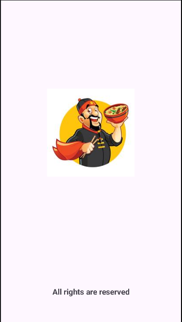
    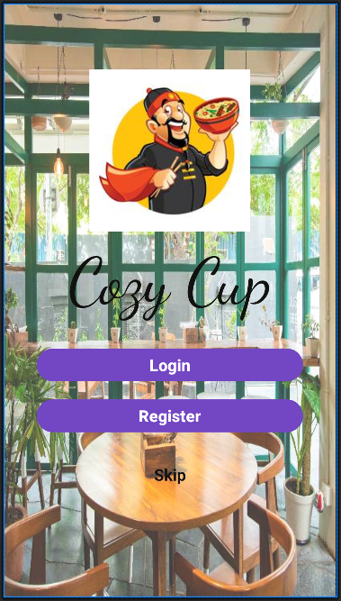
    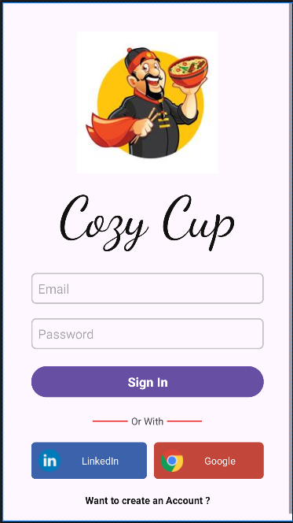
    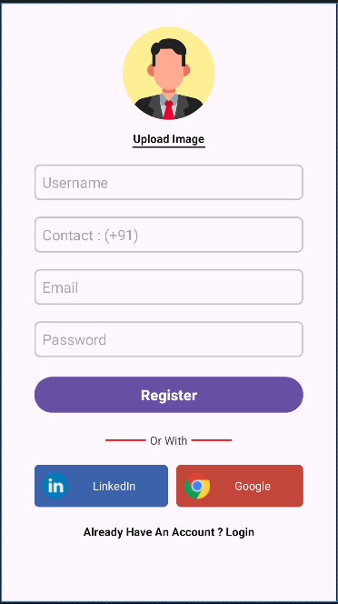
    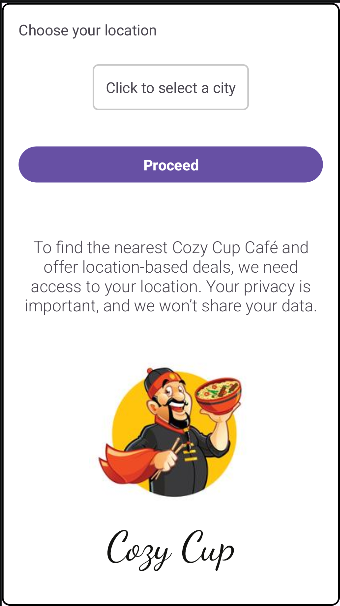
    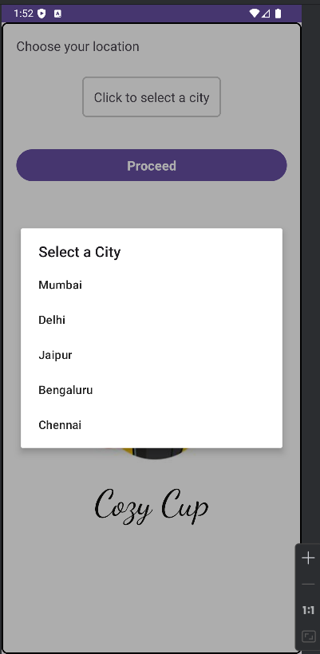
    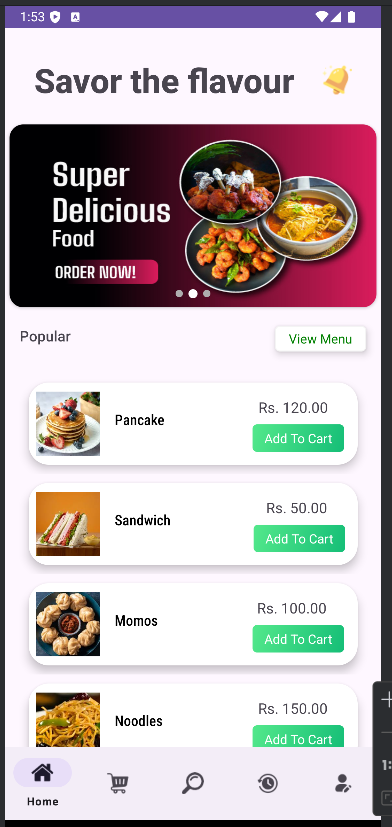
    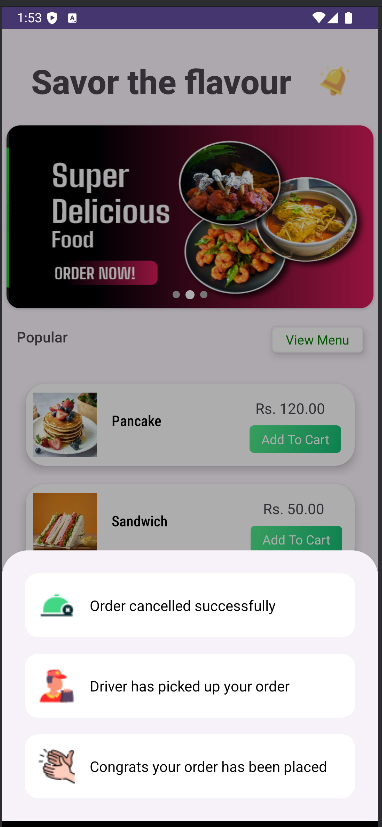
    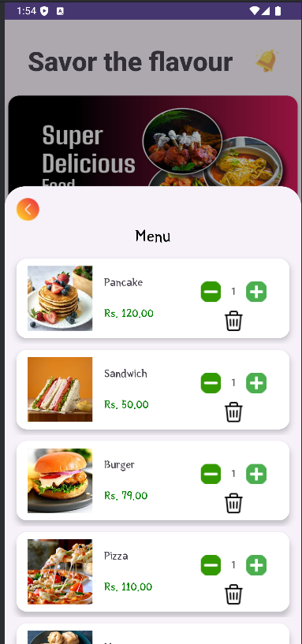
    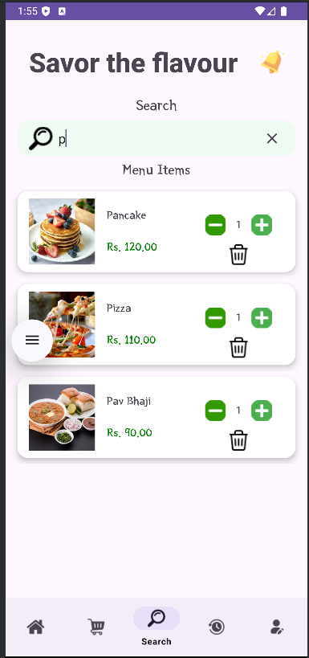
    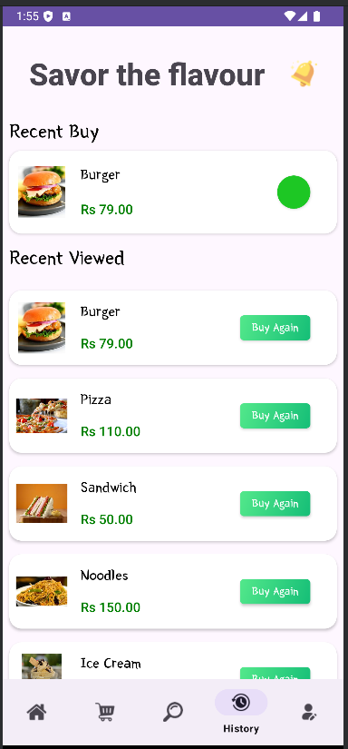
    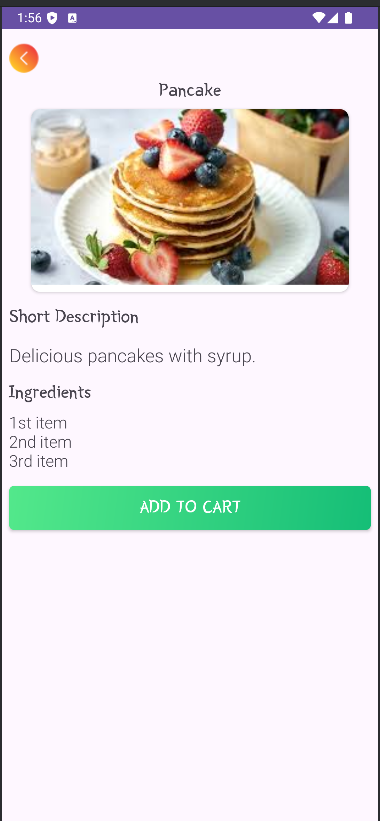
</div>


## Contributing 🤝

Contributions are welcome! If you'd like to contribute, please follow these steps:

1. Fork the repository
2. Create a new branch (`git checkout -b feature/YourFeature`)
3. Commit your changes (`git commit -m 'Add some feature'`)
4. Push to the branch (`git push origin feature/YourFeature`)
5. Open a pull request

## License 📄

This project is licensed under the MIT License - see the [LICENSE](LICENSE) file for details.

## Acknowledgements 🙏

- [Firebase](https://firebase.google.com/)
- [Stripe](https://stripe.com/)
- [Android Developers](https://developer.android.com/)

Feel free to reach out if you have any questions or feedback!

---

**Enjoy your cozy cup of food!** ☕️
